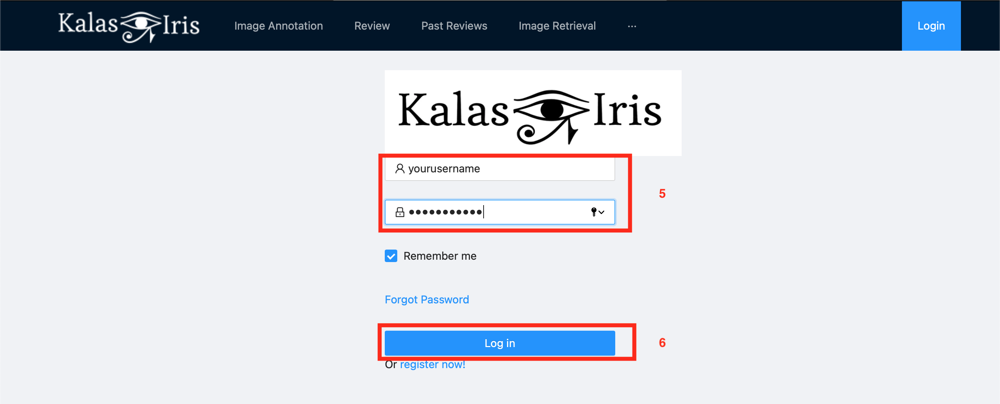
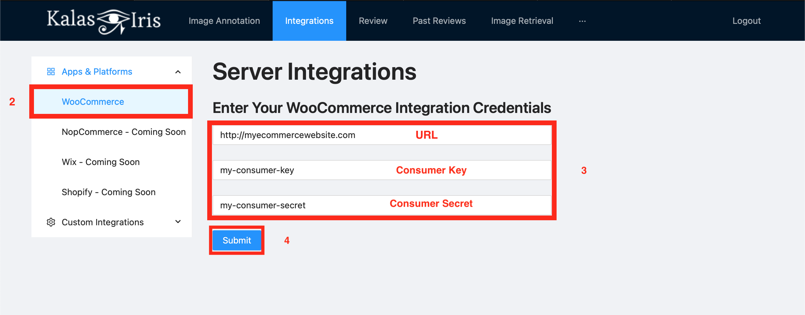

# Kalas-Iris User Manual

## 1) Build From Source

In this section we will explain how to build our project from source for exploration, testing or development.

Prefered development environment is Linux with 30GB+ disk space available. A CUDA supported GPU is required for running Machine Learning services such as image annotation and image retrieval.

Before starting you should fetch the repository from it's source:

```bash
$ git clone git@github.com:Dogacel/Kalas-Iris.git
$ cd Kalas-Iris && git pull --recurse-submodules
```

### Required Tools

#### Python3 (3.8 prefered)

```bash
$ sudo add-apt-repository ppa:deadsnakes/ppa
$ sudo apt update
$ sudo apt install python3.8
$ pip install virtualenv # Highly Suggested
```
#### NVIDIA CUDA drivers
Please install NVIDIA CUDA 11.0 drivers on your machine.
[Link](https://pytorch.org/get-started/locally/)

#### Node (14.4) and NPM

[More info](https://linuxize.com/post/how-to-install-node-js-on-ubuntu-18.04/#installing-nodejs-and-npm-using-nvm)

```bash
$ curl -o- https://raw.githubusercontent.com/nvm-sh/nvm/v0.37.2/install.sh | bash # Install node version manager (nvm)
$ nvm install 14.4 # Install the required npm version
```

#### Flutter 2.0.5

Install flutter from [source](https://flutter.dev/docs/get-started/install) and follow the instructions given.

Spin up an Android emulator or connect your Android device and enable USB debugging.

Run the application using the following command:

```bash
$ cd mobile
$ flutter pub get
$ flutter run
```

### Ngrok 
Install and setup [Ngrok](https://dashboard.ngrok.com/signup) by following the instructions.

After following the instructions for installing and connecting your account. Use the following command to expose the port where the Flask App is running (5000 by default).

```bash
$ ./ngrok http 5000
```

You can also install and use the [Visual Studio Code Extension of Ngrok](https://marketplace.visualstudio.com/items?itemName=philnash.ngrok-for-vscode). Follow the listed instructions and make sure to give the correct port number for the Flask App.

### Pre-Build configuration


#### Download python packages
```bash
$ cd api # Locate to the api/ folder
$ python -m virtualenv venv # Create a virtual env for python
$ . venv/bin/activate # Activate the virtual env use don't forget to use 'deactivate' to exit venv
$ source venv/bin/activate # Mac users should use this to activate the virtual env
$ pip install -r requirements.txt # Install python dependencies
```

Repeat the steps above again for the `mmfashion` folder as well.


#### Download MMFashion module dependencies

MMFashion setup is highly complex, you can always visit [MMFashion Docs](https://github.com/open-mmlab/mmfashion/blob/master/docs/GETTING_STARTED.md) when you need.


##### Download Pre-Trained Models
First, visit the [Model Zoo Page](https://github.com/open-mmlab/mmfashion/blob/master/docs/MODEL_ZOO.md) and download the following models:
- VGG-16 Backbone => `checkpoint/vgg16.pth`
- Attribute Prediction Coarse / ResNet-50 Global Pooling => `checkpoint/resnet_coarse_global.pth`
- Category Attribute Prediction Fine / VGG-16 Global Pooling => `checkpoint/vgg16_fine_global.pth`
- In-Shop Clothes Retrieval / VGG-16 Global Pooling => `checkpoint/Retrieve/vgg/global/epoch_100.pth`

##### Prepare Data
[MMFashion Data Preperation Docs](https://github.com/open-mmlab/mmfashion/blob/master/docs/DATA_PREPARATION.md)

[Download DeepFashion Dataset](http://mmlab.ie.cuhk.edu.hk/projects/DeepFashion.html) and put it under `mmfashion/data`.

Set your file structure as the following:
```
In-shop
├── Anno
│   ├── segmentation
│   |   ├── DeepFashion_segmentation_train.json
│   |   ├── DeepFashion_segmentation_query.json
│   |   ├── DeepFashion_segmentation_gallery.json
│   ├── list_bbox_inshop.txt
│   ├── list_description_inshop.json
│   ├── list_item_inshop.txt
│   └── list_landmarks_inshop.txt
├── Eval
│   └── list_eval_partition.txt
└── Img
    ├── img
    |   ├──XXX.jpg
    ├── img_highres
    └── ├──XXX.jpg
```

And run `python prepare_in_shop.py` to arrange the dataset. For more information check [MMFashion Dataset Docs](https://github.com/open-mmlab/mmfashion/blob/master/docs/dataset/IN_SHOP_DATASET.md).

Finally update your backend IP address to point your local under `web/src/api/api.js` and `api/flaskr/routes/image.py`.

##### MongoDB 
Create a MongoDB instance on your local or on the Mongo Atlas cloud. Update your server paths under `api/flaskr/db.py`

After creating a database, create a .env file containing your username and password. It should have the following format. 
```bash
$ DATABASE_USERNAME = "yourusername"
$ DATABASE_PASSWORD = "yourpassword"
```
For more on .env files, you can visit [here](https://pypi.org/project/python-dotenv/) and [here](https://www.ibm.com/support/knowledgecenter/ssw_aix_72/osmanagement/env_file.html)


## 2) Running

### API

```bash
$ cd api
$ sh run.sh # Or ./run.sh
```

### Website

```bash
$ cd web
$ npm start # This might take a while on the first run. It will install dependencies
```

### MMFashion

```bash
$ cd mmfashion
$ sudp python app.py
```

## 3) Using Web Interface

The website can be accesed at `http://localhost:5000` on your browser.

### Annotating Clothing Images

1. Click on the Image Annotation tab to access the image annotation page.

2. Click Upload image to upload a new image. Upload image will be automatically annotated. You can also hover over the images and delete or preview them.

3. Drag your mouse around the picture to draw a bounding box to the clothing item you want to annotate.

4. Click on the annotate cropped image button to re-annotate the image. This time only the cropped image will be annotated.

### Suggesting Better Annotations

6. You can see the suggested Attributes, Categories and Colors from these colums. You select the correct annotations via the checkbox corresponding to it. The selected annotations can be saved.

7. Click the button in order to save the suggested annotations for the image. Those annotations are saved in our backend services for improving the performance of the model.


### Reviewing Suggestions


1. Click on the 'Past Reviews' tab to see which suggestions has been made to the automatically annotated products.

2. Type the index of the item or paginate using the left and right arrows to see other suggested annotations.

3. The suggested annotations are shown on this top row.

4. The image of the annotation is shown here.

### Retrieving Similar Products


1. Click on the 'Image Retrieval' tab for searching the similar items by a given image.

2. Click Upload image to upload a new image. Upload image will be automatically used to find similar products. This process might take a while depending on your gallery size. You can also hover over the images and delete or preview them.

3. Drag your mouse around the picture to draw a bounding box to the clothing item you want to search for.

4. Click on the retrieve similar products for crop button to re-search the image. This time only the cropped image will be searched.

5. This slider shows you the retrieved similar items. You can use arrow keys to go right or left. Also the slider automatically changes images periodically.

## 4) Enabling Auto Annotation For E-Commerce Websites

### Registering To Kalas-Iris Services

 

1. Click on the "Login" tab.


2. Click to "Signup Now". It will redirect you to the signup page. 

 

3. Fill the user credentials.

4. Click "Signup". Upon success, you will be redirected to the login screen.


 

5. Enter your username and password.

6. Click login to enter to the system.

### WooCommerce API Key setup
Refer to the [WooCommerce Documentation](https://docs.woocommerce.com/document/woocommerce-rest-api/) to setup your WooCommerce API.  

### Adding API Key to Kalas-Iris


1. Click on the "Integrations" tab.



2. Click to "WooCommerce".

3. Enter the url of your website, and the consumer key and consumer secret you receieved from WooCommerce.

4. Click submit to add your integration information to Kalas-Iris.

### WooCommerce Demo Flow

1. Create a Webhook on WooCommerce by following [these steps](https://docs.woocommerce.com/document/webhooks/)


2. Launch Ngrok with the port number used by the Flask App. Ngrok will then give you the exposed URL for the back-end.


3. Make sure you choose "Product created" for Topic and enter `http://$LINK_FROM_NGROK/newProductCreated` for the "Delivery URL" and "Active" for Status. 


4. Congrats, now when you create a product with its name and image, it will be annotated automatically. 

## 5) Using Mobile Interface

### Installing the APK

Head over to [http://kalas-iris.com/app.apk](http://kalas-iris.com/app.apk) to download the APK for your device.

### Taking and Editing a Photo

<div style="text-align:center">


</div>

Once you open the app, you will be welcomed with a camera view.

1. Select whether you want to use the front-facing camera or the back-facing camera.

2. Click the camera icon to take a picture. Taking a picture will automatically forward you to the cropping view.

3. You can see the last taken picture under this gallery view. Click on the picture to show image gallery view.

After you take a picture, you will see an image editor.

1. You can select the aspect ratio, cropped area and rotation using the tools provided on the bottom bar.

2. Click on the approval icon to continue with the cropped image.

3. Click on the cancel icon to use the uncropped image.

### Using the Annotation Service

<div style="text-align:center">


</div>

Once you crop your image, or click the button on the gallery view button on your camera view, you will see the image information page. In this page you can preview your image or use one of our services using the previewed image.

1. Click the Annotate Image button to annotate the image.

2. Click the Retrieve Similar Products button to search for similar products.

After you annotate your image you will see the annotation result page.

1. Found colors can be seen on the top row slider.

2. Predicted categories can be seen on the left column.

3. Predicted attributes can be seen on the right column.

4. Click to go back to the image preview view.


### Using the Retrieval Service
<div text-align="center" style="text-align:center">

</div>

1. A sliding widget shows you the similar images the service found.

2. Click to go back to the image preview view.
